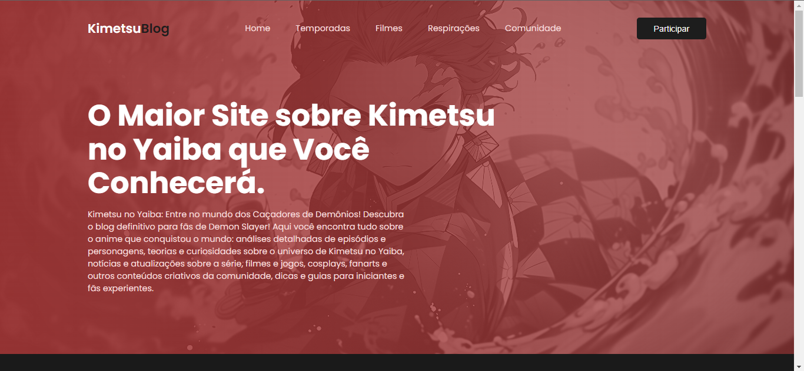

<h1 align="center"> Landing Page - KimetsuBlog </h1>

Site para atividade prática do Instituto Proa! É uma versão modificada de um tutorial HelthCare, um app de clinica hospitalar.   Decidi recriar esse site com a temática do anime Kimetsu no Yaiba (Demon Slayer), um dos animes mais famosos dos últimos tempos, destacado pela história, qualidade gráfica e trilhas sonoras impecáveis, além de ser um anime que tenho muito carinho.

 

  

 
